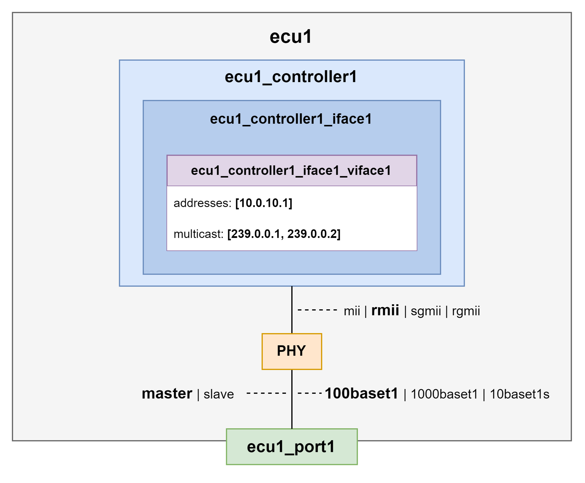
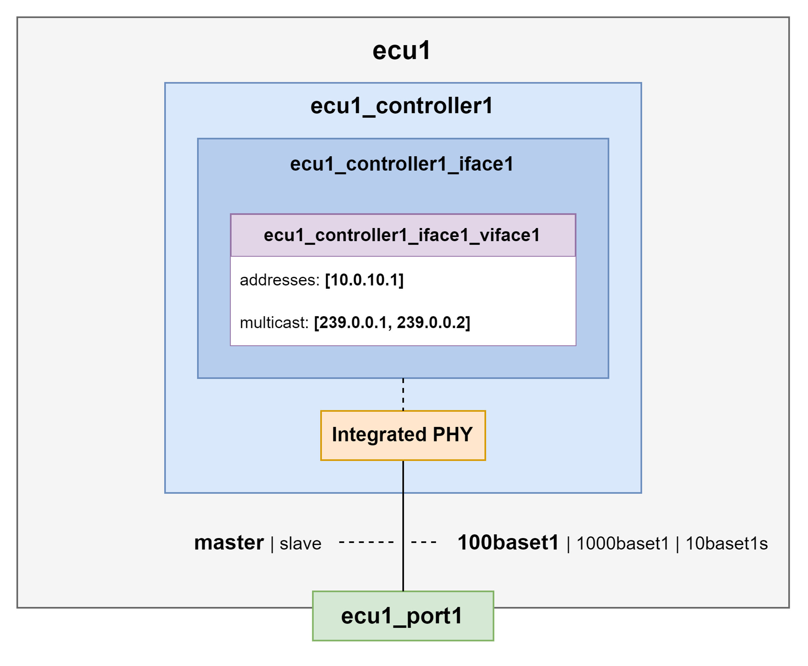
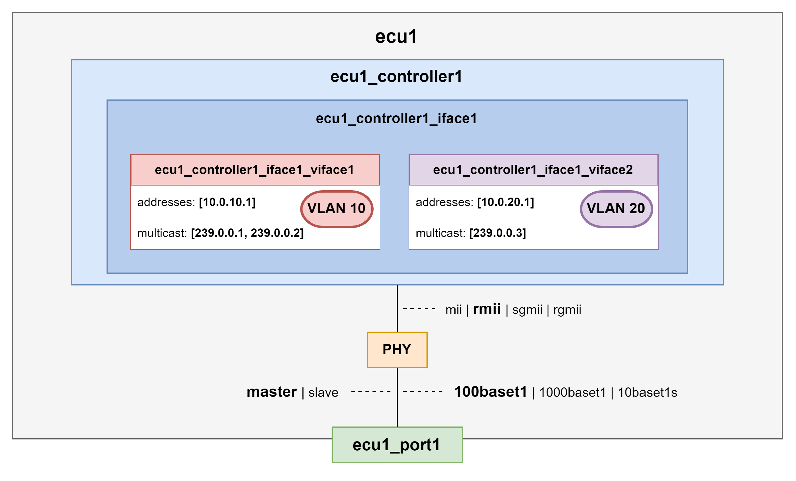
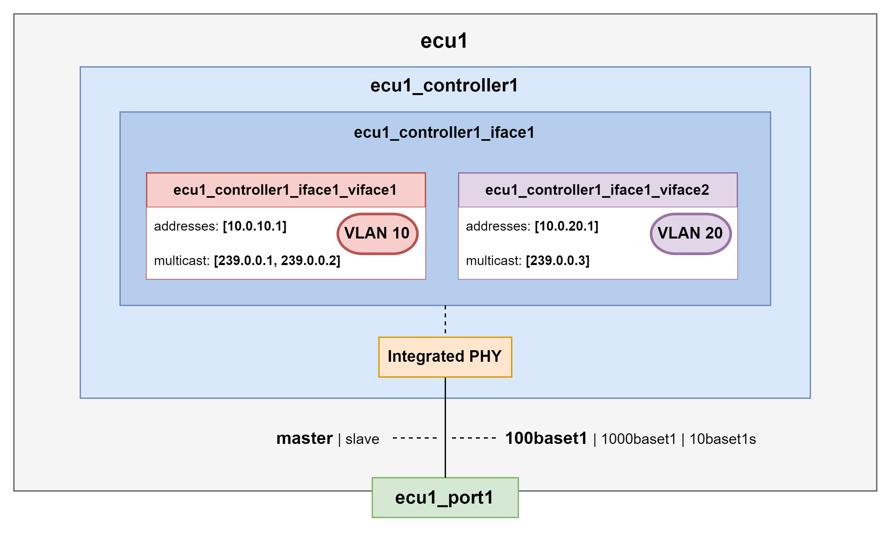
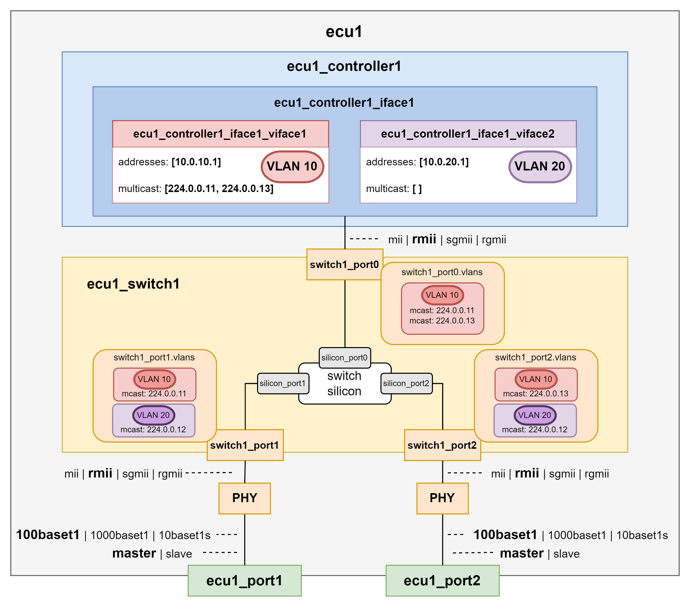
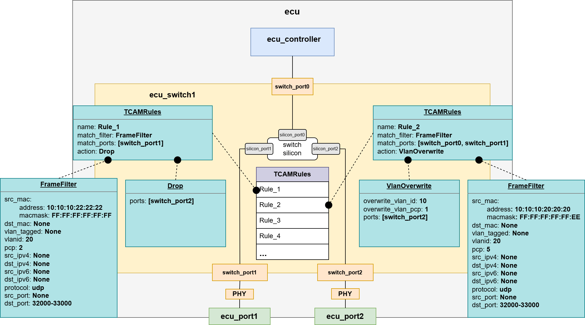

.. _flync_example:

FLYNC Examples
===============

Welcome to the configuration examples and tutorials! This section walks you through practical usage of the ``FLYNC`` configuration system with real examples.

----------

Base Example
--------------

This example provides a fully functional reference configuration that can be used as a baseline when developing your own system setup.
It demonstrates how multiple networking features can be integrated into a cohesive design, helping you understand both structure and implementation details.

The configuration includes the following key components:

- **Ethernet Network Topology** - Illustrates how devices are interconnected, including port roles, link relationships, and overall network structure. This serves as a guide for designing scalable and deterministic Ethernet architectures.

- **Time Synchronization** - Shows how gPTP configuration is defined and maintained across the network.

- **MACsec** - Shows the configuration of MACsec-aware nodes of the system for link protection.

- **Quality of Service (QoS), Layer 2 TSN, and TCAM Usage** - Provides sample configurations for traffic prioritization and deterministic networking using Time-Sensitive Networking (TSN) features. It also illustrates how TCAM rules can be allocated and used for traffic classification and filtering. You can use this configuration as a starting point, adapting interface mappings, policies, and feature parameters to match the specific requirements of your hardware platform and application.

Example Configuration
"""""""""""""""""""""""

   .. dropdown:: 📁 ``ecus/`` - ``Contains the configuration files of all the ECUs within the example``

      .. dropdown:: 📁 ``eth_ecu/`` - ``Contains all the configuration files of eth_ecu``

         .. dropdown:: 📁 ``controllers/`` - ``Contains all the configuration files for the controllers within eth_ecu``

            .. dropdown:: 📄 ``eth_ecu_controller1.flync.yaml``

               .. literalinclude:: ../../examples/flync_example/ecus/eth_ecu/controllers/eth_ecu_controller1.flync.yaml
                  :language: yaml

         .. dropdown:: 📁 ``internal_topology/`` - ``Contains the internal connections within eth_ecu``

            .. dropdown:: 📄 ``eth_ecu_topology.flync.yaml``

               .. literalinclude:: ../../examples/flync_example/ecus/eth_ecu/topology.flync.yaml
                  :language: yaml

         .. dropdown:: 📁 ``ports/`` - ``Contains the configuration file for all the ports of eth_ecu``

            .. dropdown:: 📄 ``eth_ecu_ports.flync.yaml``

               .. literalinclude:: ../../examples/flync_example/ecus/eth_ecu/ports.flync.yaml
                  :language: yaml

         .. dropdown:: 📄 ``ecu_metadata.flync.yaml`` - ``Contains the metadata for eth_ecu``

            .. literalinclude:: ../../examples/flync_example/ecus/eth_ecu/ecu_metadata.flync.yaml
               :language: yaml

      .. dropdown:: 📁 ``high_processing_core/`` - ``Contains all the configuration files of the high_processing_core``

         .. dropdown:: 📁 ``controllers/`` - ``Contains all the configuration files for the controllers within the high_processing_core``

            .. dropdown:: 📄 ``hpc_controller1.flync.yaml``

               .. literalinclude:: ../../examples/flync_example/ecus/high_processing_core/controllers/hpc_controller1.flync.yaml
                  :language: yaml

            .. dropdown:: 📄 ``hpc_controller2.flync.yaml``

               .. literalinclude:: ../../examples/flync_example/ecus/high_processing_core/controllers/hpc_controller2.flync.yaml
                  :language: yaml

         .. dropdown:: 📁 ``internal_topology/`` - ``Contains the internal connections within the high_processing_core``

            .. dropdown:: 📄 ``hpc_topology.flync.yaml``

               .. literalinclude:: ../../examples/flync_example/ecus/high_processing_core/topology.flync.yaml
                  :language: yaml

         .. dropdown:: 📁 ``ports/`` - ``Contains the configuration file for all the ports of the high_processing_core``

            .. dropdown:: 📄 ``hpc_ports.flync.yaml``

               .. literalinclude:: ../../examples/flync_example/ecus/high_processing_core/ports.flync.yaml
                  :language: yaml

         .. dropdown:: 📁 ``switches/`` - ``Contains the configuration file for all the switches of the high_processing_core``

            .. dropdown:: 📄 ``hpc_switch1.flync.yaml``

               .. literalinclude:: ../../examples/flync_example/ecus/high_processing_core/switches/hpc_switch1.flync.yaml
                  :language: yaml

         .. dropdown:: 📄 ``ecu_metadata.flync.yaml`` - ``Contains the metadata for the high_processing_core``

            .. literalinclude:: ../../examples/flync_example/ecus/high_processing_core/ecu_metadata.flync.yaml
               :language: yaml

      .. dropdown:: 📁 ``zonal_platform1/`` - ``Contains all the configuration files of the zonal_platform1``

         .. dropdown:: 📁 ``controllers/`` - ``Contains all the configuration files for the controllers within the zonal_platform1``

            .. dropdown:: 📄 ``z1_controller1.flync.yaml``

               .. literalinclude:: ../../examples/flync_example/ecus/zonal_platform1/controllers/z1_controller1.flync.yaml
                  :language: yaml

            .. dropdown:: 📄 ``z1_controller2.flync.yaml``

               .. literalinclude:: ../../examples/flync_example/ecus/zonal_platform1/controllers/z1_controller2.flync.yaml
                  :language: yaml

         .. dropdown:: 📁 ``internal_topology/`` - ``Contains the internal connections within the zonal_platform1``

            .. dropdown:: 📄 ``z1_topology.flync.yaml``

               .. literalinclude:: ../../examples/flync_example/ecus/zonal_platform1/topology.flync.yaml
                  :language: yaml

         .. dropdown:: 📁 ``ports/`` - ``Contains the configuration file for all the ports of the zonal_platform1``

            .. dropdown:: 📄 ``z1_ports.flync.yaml``

               .. literalinclude:: ../../examples/flync_example/ecus/zonal_platform1/ports.flync.yaml
                  :language: yaml

         .. dropdown:: 📁 ``switches/`` - ``Contains the configuration file for all the switches of the zonal_platform1``

            .. dropdown:: 📄 ``z1_switch1.flync.yaml``

               .. literalinclude:: ../../examples/flync_example/ecus/zonal_platform1/switches/z1_switch1.flync.yaml
                  :language: yaml

         .. dropdown:: 📄 ``ecu_metadata.flync.yaml`` - ``Contains the metadata for the zonal_platform1``

            .. literalinclude:: ../../examples/flync_example/ecus/zonal_platform1/ecu_metadata.flync.yaml
               :language: yaml

      .. dropdown:: 📁 ``zonal_platform2/`` - ``Contains all the configuration files of the zonal_platform2``

         .. dropdown:: 📁 ``controllers/`` - ``Contains all the configuration files for the controllers within the zonal_platform2``

            .. dropdown:: 📄 ``z2_controller1.flync.yaml``

               .. literalinclude:: ../../examples/flync_example/ecus/zonal_platform2/controllers/z2_controller1.flync.yaml
                  :language: yaml

            .. dropdown:: 📄 ``z2_controller2.flync.yaml``

               .. literalinclude:: ../../examples/flync_example/ecus/zonal_platform2/controllers/z2_controller2.flync.yaml
                  :language: yaml

         .. dropdown:: 📁 ``internal_topology/`` - ``Contains the internal connections within the zonal_platform2``

            .. dropdown:: 📄 ``z2_topology.flync.yaml``

               .. literalinclude:: ../../examples/flync_example/ecus/zonal_platform2/topology.flync.yaml
                  :language: yaml

         .. dropdown:: 📁 ``ports/`` - ``Contains the configuration file for all the ports of the zonal_platform2``

            .. dropdown:: 📄 ``z2_ports.flync.yaml``

               .. literalinclude:: ../../examples/flync_example/ecus/zonal_platform2/ports.flync.yaml
                  :language: yaml

         .. dropdown:: 📁 ``switches/`` - ``Contains the configuration file for all the switches of the zonal_platform2``

            .. dropdown:: 📄 ``z2_switch1.flync.yaml``

               .. literalinclude:: ../../examples/flync_example/ecus/zonal_platform2/switches/z2_switch1.flync.yaml
                  :language: yaml

         .. dropdown:: 📄 ``ecu_metadata.flync.yaml`` - ``Contains the metadata for the zonal_platform2``

            .. literalinclude:: ../../examples/flync_example/ecus/zonal_platform2/ecu_metadata.flync.yaml
               :language: yaml

   .. dropdown:: 📁 ``topology/`` - ``Contains the configuration file for ECU interconnections within the example``

      .. dropdown:: 📄 ``system_topology.flync.yaml``

         .. literalinclude:: ../../examples/flync_example/topology/system_topology.flync.yaml
            :language: yaml

   .. dropdown:: 📄 ``system_metadata.flync.yaml``

      .. literalinclude:: ../../examples/flync_example/system_metadata.flync.yaml
         :language: yaml

------

Ethernet Network Topology
""""""""""""""""""""""""""

The **Ethernet Network Topology** diagram provides a comprehensive visual representation of all components included in the configuration.

The diagram identifies the VLANs, IP addresses, and multicast groups assigned to each controller and switch, giving a complete view of the logical network segmentation and addressing scheme.

Each of the four ECUs is shown as an individual block. The diagram also illustrates the internal connectivity between components within each ECU, as well as the external connections between ECUs, making both intra-ECU and inter-ECU communication paths easy to understand.

.. image:: _static/images/examples/ethernet_topology.svg
   :align: center
   :width: 1300px

-------

QoS/L2 TSN and TCAM Configuration
"""""""""""""""""""""""""""""""""""

The **QoS / Layer 2 TSN and TCAM** Configuration diagram provides a comprehensive visual overview of the Time-Sensitive Networking (TSN) mechanisms and TCAM rules implemented in this configuration.

The diagram highlights the HTB (Hierarchical Token Bucket) shaper configured on the Linux-based controllers (eth_ecu), as well as the Credit-Based Shapers (CBS) applied on the egress ports of the switches to manage time-sensitive traffic.

It also shows the ingress stream filters deployed on the ingress ports of the switches, which are used for traffic policing and stream identification in accordance with TSN requirements.

In addition, the diagram includes the TCAM rules configured on the switch (z2_switch1), illustrating how hardware-based classification and filtering are used to enforce traffic handling policies.

.. image:: _static/images/examples/qos.svg
   :align: center
   :width: 1300px

-------

Time Synchronization Configuration
"""""""""""""""""""""""""""""""""""""

The **Timesync Configuration** diagram provides a clear visual overview of the time-synchronization roles assigned to all time-aware devices in the system.

It illustrates how time is distributed across the network, identifying which devices act as time-transmitters or time_receivers.

This helps clarify the synchronization hierarchy and the timing relationships between system components.

.. image:: _static/images/examples/ptp.svg
   :align: center
   :width: 1300px

-------

MACsec Configuration
"""""""""""""""""""""""

The **MACsec Configuration** diagram provides a clear visual overview of the roles and relationships of all MACsec participants within the system.

It identifies which devices function as MACsec peers, showing where secure channels are established and how link-layer protection is applied across the network.

This helps clarify the security topology and illustrates how data integrity (and confidentiality) is maintained between connected nodes.

.. image:: _static/images/examples/macsec.svg
   :align: center
   :width: 1300px

-------

Further Examples
--------------------

ECU Variants
""""""""""""""

Single controller, single (virtual) interface, external PHY
^^^^^^^^^^^^^^^^^^^^^^^^^^^^^^^^^^^^^^^^^^^^^^^^^^^^^^^^^^^^

.. note:: The MDI configuration must be compliant with that of the other ECU to which the port is connected to. In this case, ``mode``, ``speed`` and ``duplex`` must match; while ``role`` must be opposite to that of the other ECU config (i.e., if slave in the connected ECU, master shall be configured).

.. note:: The MII configuration must be compliant with that of the ECU controller configuration. In this case, ``type`` and ``speed`` must match; while ``mode`` must oppose the controller interface config (i.e., if mac in the controller interface, phy shall be configured).

.. dropdown:: 📄 ``ecu1_ports.flync.yaml``

   .. code-block:: yaml

      ports:
         -  name: ecu1_port1
            mdi_config:
               mode: base_t1
               speed: 100
               duplex: full
               role: master
               autonegotiation: false
            mii_config:
               type: rmii
               speed: 100
               mode: phy

.. dropdown:: 📄 ``ecu1_controller1.flync.yaml``

   .. code-block:: yaml

      meta:
         author: Developer1
         compatible_flync_version:
            version_schema: semver
            version: 0.9.0
         target_system: flync_os
      name: ecu1_controller1
      interfaces:
         -  name: ecu1_controller1_iface1
            mac_address: 00:11:22:33:44:55
            mii_config:
               type: rmii
               speed: 100
               mode: mac
            virtual_interfaces:
               -  name: ecu1_controller1_iface1_viface1
                  vlanid: 0
                  addresses:
                     -  address: 10.0.10.1
                        ipv4_netmask: 255.255.255.0
                  multicast:
                     -  239.0.0.1
                     -  239.0.0.2

.. dropdown:: 📄 ``ecu1_internal_topology.flync.yaml``

   .. code-block:: yaml

      connections:
         - type: ecu_port_to_controller_interface
           id: conn1
           ecu_port: ecu1_port1
           controller_interface: ecu1_controller1_iface1

--------------

Single controller, single (virtual) interface, integrated PHY
^^^^^^^^^^^^^^^^^^^^^^^^^^^^^^^^^^^^^^^^^^^^^^^^^^^^^^^^^^^^^^^^

.. note:: Since PHY is integrated into the host controller, no MII configuration is needed on the port side.

.. dropdown:: 📄 ``ecu1_ports.flync.yaml``

   .. code-block:: yaml

      ports:
      -  name: ecu1_port1
         mdi_config:
            mode: base_t1
            speed: 100
            duplex: full
            role: master
            autonegotiation: false
         mii_config: null

.. note:: Since PHY is integrated into the host controller, no MII configuration is needed in the controller either.

.. dropdown:: 📄 ``ecu1_controller1.flync.yaml``

   .. code-block:: yaml

      meta:
         author: Developer1
         compatible_flync_version:
            version_schema: semver
            version: 0.9.0
         target_system: flync_os
      name: ecu1_controller1
      interfaces:
         -  name: ecu1_controller1_iface1
            mac_address: 00:11:22:33:44:55
            mii_config: null
            virtual_interfaces:
               -  name: ecu1_controller1_iface1_viface1
                  vlanid: 0
                  addresses:
                     -  address: 10.0.10.1
                        ipv4_netmask: 255.255.255.0
                  multicast:
                     - 239.0.0.1
                     - 239.0.0.2

.. dropdown:: 📄 ``ecu1_internal_topology.flync.yaml``

   .. code-block:: yaml

      connections:
         -  type: ecu_port_to_controller_interface
            id: conn1
            ecu_port: ecu1_port1
            controller_interface: ecu1_controller1_iface1

--------------

Single controller, multiple (virtual) interfaces, external PHY
^^^^^^^^^^^^^^^^^^^^^^^^^^^^^^^^^^^^^^^^^^^^^^^^^^^^^^^^^^^^^^^^

.. dropdown:: 📄 ``ecu1_ports.flync.yaml``

   .. code-block:: yaml

      ports:
      -  name: ecu1_port1
         mdi_config:
            mode: base_t1
            speed: 100
            duplex: full
            role: master
            autonegotiation: false
        mii_config:
            type: rmii
            speed: 100
            mode: phy

.. dropdown:: 📄 ``ecu1_controller1.flync.yaml``

   .. code-block:: yaml

      meta:
         author: Developer1
         compatible_flync_version:
            version_schema: semver
            version: 0.9.0
         target_system: flync_os
      name: ecu1_controller1
      interfaces:
         -  name: ecu1_controller1_iface1
            mac_address: 00:11:22:33:44:55
            mii_config:
               type: rmii
               speed: 100
               mode: mac
            virtual_interfaces:
               -  name: ecu1_controller1_iface1_viface1
                  vlanid: 10
                  addresses:
                     -  address: 10.0.10.1
                        ipv4_netmask: 255.255.255.0
                  multicast:
                     - 239.0.0.1
                     - 239.0.0.2
               -  name: ecu1_controller1_iface1_viface2
                  vlanid: 20
                  addresses:
                     -  address: 10.0.20.1
                        ipv4_netmask: 255.255.255.0
                  multicast:
                     - 239.0.0.3

.. dropdown:: 📄 ``ecu1_internal_topology.flync.yaml``

   .. code-block:: yaml

      connections:
         -  type: ecu_port_to_controller_interface
            id: conn1
            ecu_port: ecu1_port1
            controller_interface: ecu1_controller1_iface1

--------------

Single controller, multiple (virtual) interfaces, integrated PHY
^^^^^^^^^^^^^^^^^^^^^^^^^^^^^^^^^^^^^^^^^^^^^^^^^^^^^^^^^^^^^^^^^^

.. dropdown:: 📄 ``ecu1_ports.flync.yaml``

   .. code-block:: yaml

      ports:
         -  name: ecu1_port1
            mdi_config:
               mode: base_t1
               speed: 100
               duplex: full
               role: master
               autonegotiation: false
            mii_config: null

.. dropdown:: 📄 ``ecu1_controller1.flync.yaml``

   .. code-block:: yaml

      meta:
         author: Developer1
         compatible_flync_version:
            version_schema: semver
            version: 0.9.0
         target_system: flync_os
      name: ecu1_controller1
      interfaces:
         -  name: ecu1_controller1_iface1
            mac_address: 00:11:22:33:44:55
            mii_config: null
            virtual_interfaces:
               -  name: ecu1_controller1_iface1_viface1
                  vlanid: 10
                  addresses:
                     -  address: 10.0.10.1
                        ipv4_netmask: 255.255.255.0
                  multicast:
                     - 239.0.0.1
                     - 239.0.0.2
               -  name: ecu1_controller1_iface1_viface2
                  vlanid: 20
                  addresses:
                     -  address: 10.0.20.1
                        ipv4_netmask: 255.255.255.0
                  multicast:
                        - 239.0.0.3

.. dropdown:: 📄 ``ecu1_internal_topology.flync.yaml``

   .. code-block:: yaml

      connections:
         -  type: ecu_port_to_controller_interface
            id: conn1
            ecu_port: ecu1_port1
            controller_interface: ecu1_controller1_iface1

--------------

Switch ECU, multiple (virtual) interfaces, external PHY
^^^^^^^^^^^^^^^^^^^^^^^^^^^^^^^^^^^^^^^^^^^^^^^^^^^^^^^^^^

.. dropdown:: 📄 ``ecu1_ports.flync.yaml``

   .. code-block:: yaml

      ports:
         -  name: ecu1_port1
            mdi_config:
               mode: base_t1
               speed: 100
               duplex: full
               role: master
               autonegotiation: false
            mii_config:
               type: rmii
               speed: 100
               mode: phy
         -  name: ecu1_port2
            mdi_config:
               mode: base_t1
               speed: 100
               duplex: full
               role: master
               autonegotiation: false
            mii_config:
               type: rmii
               speed: 100
               mode: phy

.. dropdown:: 📄 ``ecu1_controller1.flync.yaml``

   .. code-block:: yaml

      meta:
         author: Developer1
         compatible_flync_version:
            version_schema: semver
            version: 0.9.0
         target_system: flync_os
      name: ecu1_controller1
      interfaces:
         -  name: ecu1_controller1_iface1
            mac_address: 00:11:22:33:44:55
            mii_config:
                  type: rmii
                  speed: 100
                  mode: phy
            virtual_interfaces:
               -  name: ecu1_controller1_iface1_viface1
                  vlanid: 10
                  addresses:
                     -  address: 10.0.10.1
                        ipv4_netmask: 255.255.255.0
                  multicast:
                     - 224.0.0.11
                     - 224.0.0.13
               -  name: ecu1_controller1_iface1_viface2
                  vlanid: 20
                  addresses:
                     -  address: 10.0.20.1
                        ipv4_netmask: 255.255.255.0
                  multicast: null

.. dropdown:: 📄 ``ecu1_switch1.flync.yaml``

   .. code-block:: yaml

      meta:
         author: Developer1
         compatible_flync_version:
            version_schema: semver
            version: 0.9.0
         target_system: flync_os
      name: ecu1_switch1
      ports:
         -  name: switch1_port1
            silicon_port_no: 1
            default_vlan_id: 1
            mii_config:
               type: rmii
               speed: 100
               mode: mac
         -  name: switch1_port2
            silicon_port_no: 2
            default_vlan_id: 1
            mii_config:
               type: rmii
               speed: 100
               mode: mac
         -  name: switch1_port0
            silicon_port_no: 0
            default_vlan_id: 1
            mii_config:
               type: rmii
               speed: 100
               mode: mac
      vlans:
         -  name: vlan10
            id: 10
            default_priority: 0
            ports:
               - switch1_port0
               - switch1_port1
               - switch1_port2
            multicast:
               -  address: 224.0.0.11
                  ports:
                     - switch1_port0
                     - switch1_port1
               -  address: 224.0.0.13
                  ports:
                        - switch1_port0
                        - switch1_port2
         -  name: vlan20
            id: 20
            default_priority: 0
            ports:
               - switch1_port1
               - switch1_port2
            multicast:
               -  address: 224.0.0.12
                  ports:
                     - switch1_port1
                     - switch1_port2

.. note:: The MII ``mode`` of the ``switch1_port0`` must oppose the one of the ``ecu1_controller1_iface1``.

.. dropdown:: 📄 ``ecu1_internal_topology.flync.yaml``

   .. code-block:: yaml

      connections:
         -  type: ecu_port_to_switch_port
            id: conn1
            ecu_port: ecu1_port1
            switch_port: switch1_port1
         -  type: ecu_port_to_switch_port
            id: conn2
            ecu_port: ecu1_port2
            switch_port: switch1_port2
         -  type: switch_port_to_controller_interface
            id: conn3
            switch_port: switch1_port0
            controller_interface: ecu1_controller1_iface1

--------------

Switch ECU with Host controller, multiple (virtual) interfaces, external PHY
^^^^^^^^^^^^^^^^^^^^^^^^^^^^^^^^^^^^^^^^^^^^^^^^^^^^^^^^^^^^^^^^^^^^^^^^^^^^^^^^

.. image:: ./_static/images/ecu_variants/switch_ecu_with_host_ext_PHY.png
   :align: center
   :width: 800px

.. dropdown:: 📄 ``ecu1_ports.flync.yaml``

   .. code-block:: yaml

         ports:
            -  name: ecu1_port1
               mdi_config:
                  mode: base_t1
                  speed: 100
                  duplex: full
                  role: master
                  autonegotiation: false
               mii_config:
                  type: rmii
                  speed: 100
                  mode: phy
            -  name: ecu1_port2
               mdi_config:
                  mode: base_t1
                  speed: 100
                  duplex: full
                  role: master
                  autonegotiation: false
               mii_config:
                  type: rmii
                  speed: 100
                  mode: phy

.. dropdown:: 📄 ``ecu1_controller1.flync.yaml``

   .. code-block:: yaml

         meta:
            author: Developer1
            compatible_flync_version:
               version_schema: semver
               version: 0.9.0
         target_system: flync_os
         name: ecu1_controller1
         interfaces:
            -  name: ecu1_controller1_iface1
               mac_address: 00:11:22:33:44:55
               mii_config:
                  type: rmii
                  speed: 100
                  mode: phy
               virtual_interfaces:
                  -  name: ecu1_controller1_iface1_viface1
                     vlanid: 10
                     addresses:
                        -  address: 10.0.10.1
                           ipv4_netmask: 255.255.255.0
                     multicast:
                        - 224.0.0.11
                        - 224.0.0.13
                  -  name: ecu1_controller1_iface1_viface2
                     vlanid: 20
                     addresses:
                        -  address: 10.0.20.1
                           ipv4_netmask: 255.255.255.0
                  -  name: ecu1_controller1_iface1_viface3
                     vlanid: 30
                     addresses:
                        -  address: 10.0.30.1
                           ipv4_netmask: 255.255.255.0
                     

.. dropdown:: 📄 ``ecu1_switch1.flync.yaml``

   .. code-block:: yaml

         meta:
            author: Developer1
            compatible_flync_version:
               version_schema: semver
               version: 0.9.0
         name: ecu1_switch1
         ports:
            -  name: switch1_port1
               silicon_port_no: 1
               default_vlan_id: 1
               mii_config:
                  type: rmii
                  speed: 100
                  mode: mac
            -  name: switch1_port2
               silicon_port_no: 2
               default_vlan_id: 1
               mii_config:
                  type: rmii
                  speed: 100
                  mode: mac
            -  name: switch1_port0
               silicon_port_no: 0
               default_vlan_id: 1
               mii_config:
                  type: rmii
                  speed: 100
                  mode: mac
         vlans:
            -  name: vlan10
               id: 10
               default_priority: 0
               ports:
                  - switch1_port0
                  - switch1_port1
                  - switch1_port2
               multicast:
                  -  address: 224.0.0.11
                     ports:
                        - switch1_port0
                        - switch1_port1
                  -  address: 224.0.0.13
                     ports:
                           - switch1_port0
                           - switch1_port2
            -  name: vlan20
               id: 20
               default_priority: 0
               ports:
                  - switch1_port1
                  - switch1_port2
               multicast:
                  -  address: 224.0.0.12
                     ports:
                        - switch1_port1
                        - switch1_port2
            -  name: vlan30
               id: 30
               default_priority: 0
               ports:
                  - switch1_port0
         host_controller:
            name: ecu1_switch1_controlleriface1
            mac_address: 00:11:22:33:44:66
            virtual_interfaces:
            -  name: vlan30
               vlanid: 30
               addresses:
                  -  address: 10.0.30.100
                     ipv4_netmask: 255.255.255.0
               multicast: null

.. note:: The MII ``mode`` of the ``switch1_port0`` must oppose the one of the ``ecu1_controller1_iface1``.

.. note:: The Host controller of the switch will have the same configuration as any Controller Interface.

.. dropdown:: 📄 ``ecu1_internal_topology.flync.yaml``

   .. code-block:: yaml

      connections:
         -  type: ecu_port_to_switch_port
            id: conn1
            ecu_port: ecu1_port1
            switch_port: switch1_port1
         -  type: ecu_port_to_switch_port
            id: conn2
            ecu_port: ecu1_port2
            switch_port: switch1_port2
         -  type: switch_port_to_controller_interface
            id: conn3
            switch_port: switch1_port0
            controller_interface: ecu1_controller1_iface1

--------------

Internal Topology (Configuration and Types)
""""""""""""""""""""""""""""""""""""""""""""""

The internal topology file of each configured ECU must contain the description of all the internal connections within the device. The FLYNC model supports the connection types present in the following picture:

.. important:: Be aware of the kind of connection that is added to the file, since the name of the components shall adjust to it accordingly.

**Example file (dummy example)**

.. image:: ./_static/images/internal_topology/internal_topology.png
   :align: center
   :width: 1000px

.. dropdown:: 📄 ``ecu1_internal_topology.flync.yaml``

   .. code-block:: yaml

      connections:
         -  type: ecu_port_to_switch_port
            id: conn1
            ecu_port: ecu1_port2
            switch_port: switch1_port1
         -  type: ecu_port_to_switch_port
            id: conn2
            ecu_port: ecu1_port3
            switch_port: switch1_port2
         -  type: ecu_port_to_switch_port
            id: conn3
            ecu_port: ecu1_port4
            switch_port: switch2_port1
         -  type: ecu_port_to_switch_port
            id: conn4
            ecu_port: ecu1_port5
            switch_port: switch2_port2
         -  type: ecu_port_to_controller_interface
            id: conn5
            ecu_port: ecu1_port1
            controller_interface: ecu1_controller1_iface1
         -  type: switch_port_to_controller_interface
            id: conn6
            switch_port: switch1_port0
            controller_interface: ecu1_controller1_iface2
         -  type: switch_port_to_controller_interface
            id: conn7
            switch_port: switch2_port0
            controller_interface: ecu1_controller2_iface1
         -  type: controller_interface_to_controller_interface
            id: conn8
            controller_interface1: ecu1_controller1_iface2
            controller_interface2: ecu1_controller2_iface1
         -  type: switch_port_to_switch_port
            id: conn9
            switch_port: switch1_port3
            switch2_port: switch2_port3

--------------

Additional Security Features Configuration
""""""""""""""""""""""""""""""""""""""""""""

Firewall Configuration
^^^^^^^^^^^^^^^^^^^^^^

The Firewall model consists of a default action and three lists defining rules for input, output and forward traffic, respectively.
Each of these rules contains a pattern the packets are matched agaisnt, and an action executed when this check is positive:

.. dropdown:: 📄 ``ecu1_controller1.flync.yaml``

   .. code-block:: yaml

      meta:
         author: Developer1
         compatible_flync_version:
            version_schema: semver
            version: 0.9.0
      name: ecu1_controller1
      interfaces:
         -  name: ecu1_controller1_iface1
            mac_address: 00:11:22:33:44:88
            mii_config:
            type: rmii
            speed: 100
            mode: mac
            virtual_interfaces:
            -  name: ecu1_controller1_iface1_viface1
               vlanid: 0
               addresses:
                  -  address: 10.0.10.3
                     ipv4_netmask: 255.255.255.0
            firewall:
               default_action: drop
               input_rules:
                  -  name: allow_ssh
                     action: accept
                     pattern:
                     src_ipv4: 10.0.0.2
                     protocol: tcp
                     dst_port: 22
                     vlan_tagged: true
               output_rules:
                  -  name: drop_output_vlan_33
                     action: drop
                     pattern:
                     dst_ipv4:
                        address: 10.0.0.1
                        ipv4netmask : 255.255.255.0
                     vlanid: 33
               forward_rules:
                  -  name: allow_forwarded_udp
                     action: accept
                     pattern:
                     src_ipv4:
                        address: 10.0.0.2
                        ipv4netmask : 255.255.255.0
                     dst_ipv4:
                        address: 10.0.0.3
                        ipv4netmask : 255.255.255.0
                     protocol: udp
                     dst_port:
                           from_value: 30490
                           to_value: 30509

--------------

Switch TCAM Configuration
^^^^^^^^^^^^^^^^^^^^^^^^^^^^

.. dropdown:: 📄 ``ecu1_switch1.flync.yaml``

   .. code-block:: yaml

         meta:
            author: Developer1
            compatible_flync_version:
               version_schema: semver
               version: 0.9.0
         name: ecu_switch1
         ports:
         -  name: switch_port0
            silicon_port_no: 1
            default_vlan_id: 1
            mii_config:
               type: rmii
               speed: 100
               mode: mac

         -  name: switch_port1
            silicon_port_no: 2
            default_vlan_id: 1
            mii_config:
               type: rmii
               speed: 100
               mode: mac

         -  name: switch_port2
            silicon_port_no: 3
            default_vlan_id: 1
            mii_config:
               type: rmii
               speed: 100
               mode: mac

         tcam_rules:
            -  name: Rule_1
               match_filter:
               src_mac:
                  address: "10:10:10:22:22:22"
                  macmask: "FF:FF:FF:FF:FF:FF"
               vlanid: 20
               pcp: 2
               protocol: udp
               dst_port:
                  from_value: 32000
                  to_value: 33000
               match_ports: [switch_port1]
               action:
               -  type: drop
                  ports: [switch_port2]

            -  name: Rule_2
               match_filter:
               src_mac:
                  address: "10:10:10:20:20:20"
                  macmask: "FF:FF:FF:FF:FF:EE"
               vlanid: 20
               pcp: 5
               protocol: udp
               dst_port:
                  from_value: 32000
                  to_value: 33000
               match_ports: [switch_port0, switch_port1]
               action:
                  -  type: vlan_overwrite
                     overwrite_vlan_id: 10
                     overwrite_vlan_pcp: 1
                     ports: [switch_port2]

         vlans:
         -  name: VLAN10
            id: 10
            default_priority: 1
            ports:
               - switch_port0
               - switch_port1
               - switch_port2

         -  name: VLAN20
            id: 20
            default_priority: 1
            ports:
               - switch_port0
               - switch_port1
               - switch_port2

--------------

Sockets Configuration
""""""""""""""""""""""""

A socket in FLYNC represents a logical endpoint on a virtual network interface of an ECU. It defines how the controller will send and receive traffic over a specific IP address, port, and protocol (TCP/UDP).

.. image:: ./_static/images/sockets/sockets.svg
   :align: center
   :width: 1000px

.. note:: Sockets must be defined in a separate folder for each ECU for better readability.
.. note:: Multiple sockets may be defined in a single file for different address endpoints, but they must belong to the same VLAN.
